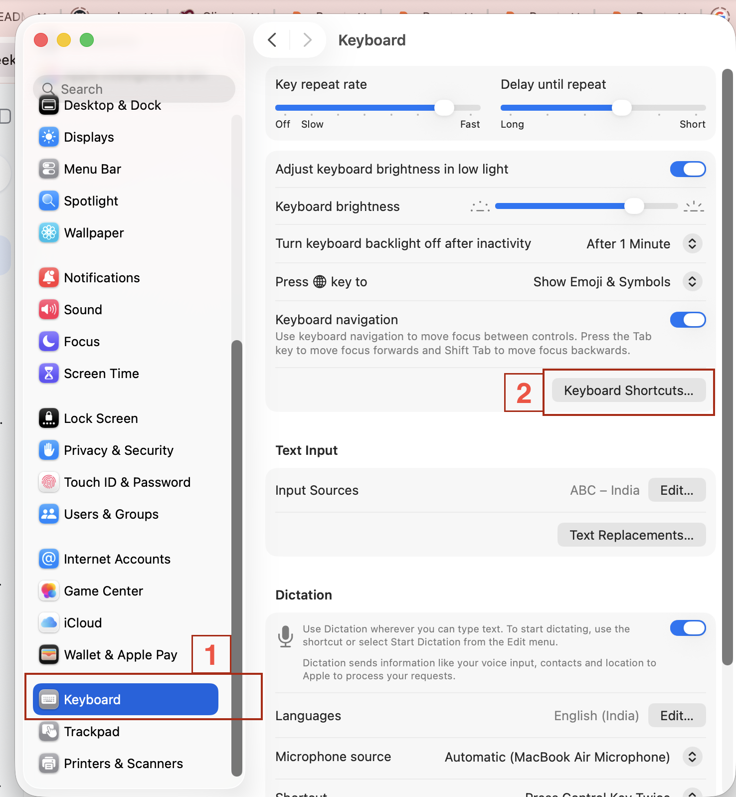
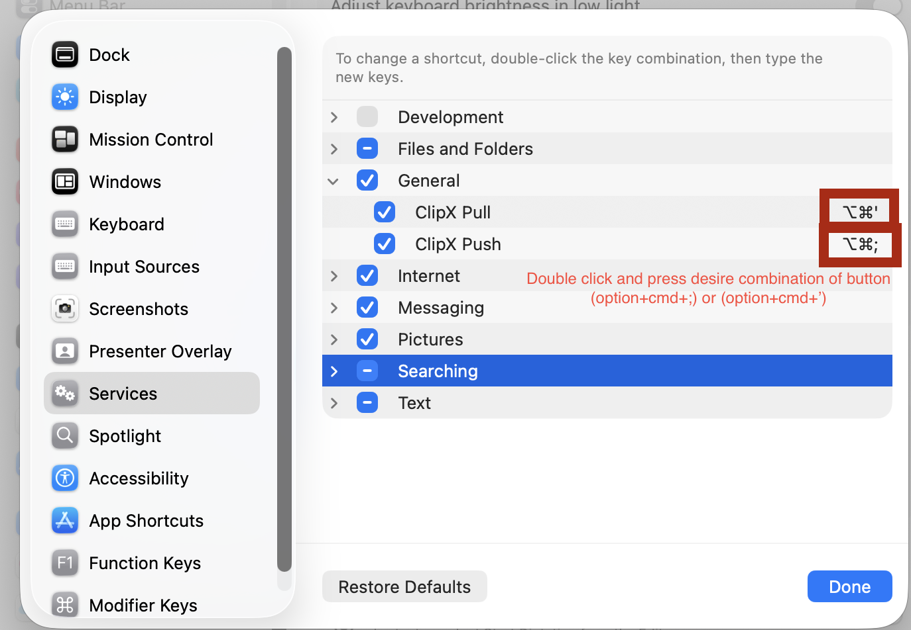
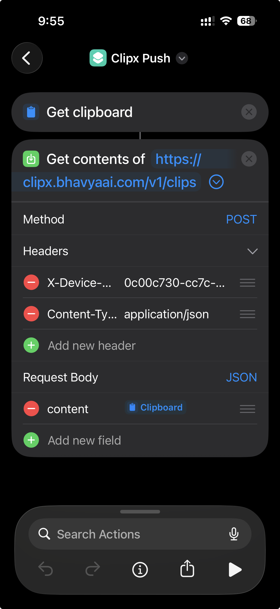
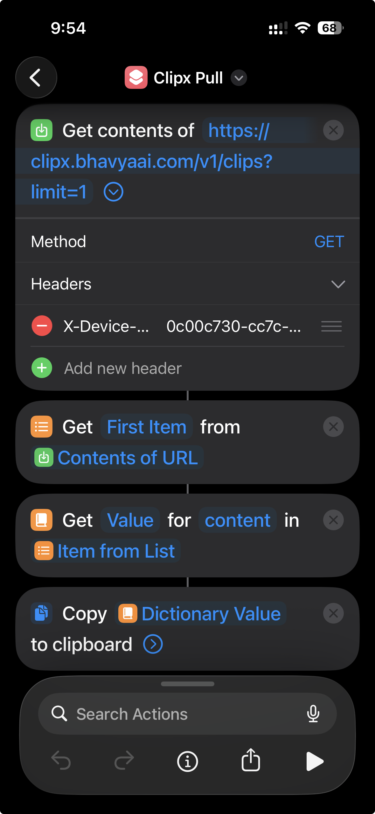

# ClipX

Self-hosted clipboard and file sync server. Copy on one device, paste on another — with file sharing and an admin panel.

## Features

- **Clipboard Sync** — Push clipboard content from any device and pull it on others
- **File Sharing** — Upload files with configurable TTL, auto-cleanup on expiry
- **Device Management** — Register devices with unique secret keys via admin panel
- **Admin Panel** — Built-in dark-themed web UI to manage clips, files, and devices
- **JWT Auth** — Secure admin login with JWT tokens
- **CORS** — Works with browser extensions and local dev servers
- **SQLite** — Zero-dependency database, no setup required

## Architecture

```
POST   /v1/clips         Create a clip (device auth)
GET    /v1/clips         List recent clips
DELETE /v1/clips/:id     Delete a clip
POST   /v1/files         Upload a file
GET    /v1/files         List active files
GET    /v1/files/:id/download  Download a file
DELETE /v1/files/:id     Delete a file
GET    /v1/devices       List devices
DELETE /v1/devices/:id   Remove a device
GET    /admin            Admin panel (login required)
POST   /v1/admin/login   Admin login
```

## Quick Start

```bash
git clone https://github.com/rjamitsharma/clipx.git
cd clipx

cp .env.example .env
# Edit .env with your credentials

pip install -r requirements.txt

python main.py
```

Go to `http://localhost:5000/admin` to access the admin panel.

## Environment Variables

| Variable | Description | Default |
|---|---|---|
| `ADMIN_EMAIL` | Admin login email | — |
| `ADMIN_PASSWORD` | Admin login password | — |
| `JWT_SECRET` | Secret for signing admin JWT tokens | — |
| `FILES_DIR` | Directory for uploaded files | `uploads` |
| `FILE_TTL_MINUTES` | File expiry time in minutes | `30` |

## macOS Workflow (Automator)

### ClipX Push (Copy → Server)

Go to **Automator → New Document → Workflow → Run Shell Script**. Paste this after updating the URL and device secret:

```bash
export LANG=en_US.UTF-8
export LC_ALL=en_US.UTF-8

JSON_DATA=$(pbpaste | python3 -c 'import sys, json; print(json.dumps({"content": sys.stdin.read()}, ensure_ascii=False))')

curl -s -X POST https://your-domain.com/v1/clips \
  -H "X-Device-Secret: your-device-id-from-admin-panel" \
  -H "Content-Type: application/json; charset=utf-8" \
  --data-raw "$JSON_DATA"

osascript -e "display notification \"↗️\" with title \"ClipX Push ✓\""
```

### ClipX Pull (Server → Clipboard + Auto-Paste)

Create a new Automator **Run Shell Script** workflow with:

```bash
export LANG=en_US.UTF-8
export LC_ALL=en_US.UTF-8

cat > /tmp/clipx.py << 'EOF'
import json
import subprocess
import time
import urllib.request

from pynput.keyboard import Controller, Key

keyboard = Controller()

try:
    url = 'https://your-domain.com/v1/clips?limit=1'

    req = urllib.request.Request(url)
    req.add_header('X-Device-Secret', 'your-device-id-from-admin-panel')
    req.add_header('User-Agent', 'Mozilla/5.0')

    with urllib.request.urlopen(req) as response:
        d = json.loads(response.read().decode('utf-8'))

    if d and len(d) > 0:
        content = d[0]['content']

        subprocess.run(['pbcopy'], input=content, text=True)

        time.sleep(0.4)

        keyboard.press(Key.cmd)
        keyboard.press('v')
        keyboard.release('v')
        keyboard.release(Key.cmd)

        subprocess.run([
            'osascript',
            '-e',
            'display notification "Pulled & Pasted" with title "ClipX"'
        ])
    else:
        subprocess.run([
            'osascript',
            '-e',
            'display notification "No clips found" with title "ClipX"'
        ])
except Exception as e:
    safe_error = str(e).replace('\"', '\\\"')
    subprocess.run([
        'osascript',
        '-e',
        f'display notification "{safe_error}" with title "ClipX Error"'
    ])
    print(f'Error: {e}')
EOF

/opt/homebrew/opt/python@3.13/libexec/bin/python3 /tmp/clipx.py
```

> **Note:** Make sure `pynput` is installed (`pip3 install pynput`). Adjust the Python path if needed.

### Keyboard Shortcuts



Go to **System Settings → Keyboard → Keyboard Shortcuts → Services**, find your workflows, and assign hotkeys:



Example hotkeys:
- Push: `⌥⌘;`
- Pull: `⌥⌘'`

> Once you save these workflows in Automator, any clip you push from any device will appear instantly on the server at `/admin` under the **Clips** tab — and you can pull it on any other connected device.

## iPhone Shortcuts

### ClipX Push (Clipboard → Server)



1. Open **Shortcuts** app, tap `+` to create a new shortcut
2. Add action: **Get Clipboard**
3. Add action: **Get Contents of URL**
   - URL: `https://your-domain.com/v1/clips`
   - Method: `POST`
4. Add headers:
   - `X-Device-Secret`: your device ID from admin panel
   - `Content-Type`: `application/json`
5. Request Body → JSON → add field `content` with value set to **Clipboard** variable

### ClipX Pull (Server → Clipboard)



1. Create a new shortcut with **Get Contents of URL**
   - URL: `https://your-domain.com/v1/clips?limit=1`
   - Method: `GET`
   - Header: `X-Device-Secret`: your device ID
2. Add action: **Get Item from List** → `First Item`
3. Add action: **Get Dictionary Value** → key: `content`
4. Add action: **Copy to Clipboard**

You can assign these shortcuts to **Back Tap** (Settings → Accessibility → Touch → Back Tap):
- Double Tap → Push
- Triple Tap → Pull

## Deployment

The project includes `passenger_wsgi.py` for Phusion Passenger deployments (cPanel, shared hosting). Set `application` as the WSGI entry point in Passenger.

## License

MIT © rjamitsharma
